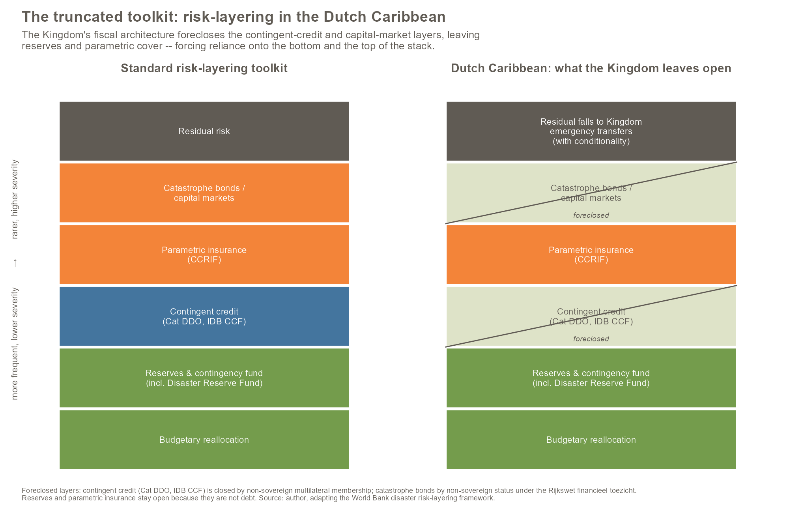

::: {.callout-note title="In brief"}

A layered toolkit for financing disaster recovery has matured over the past fifteen years, from budgetary reserves through parametric insurance and contingent credit to catastrophe bonds. The Dutch Caribbean buys almost none of it, while holding more foreign reserves than its currency pegs require. Part of the gap is structural. As autonomous countries within the Kingdom rather than sovereign states, Aruba, Curacao and Sint Maarten cannot tap the pre-agreed emergency credit lines their independent neighbours use, and they cannot issue catastrophe bonds. Part of the gap is a choice. The layers they can reach, parametric insurance and a self-financed reserve fund, they have barely used, while the Eastern Caribbean, Barbados and the Bahamas have built them out.

Relying on reserves alone is the most expensive way to carry a risk that cheaper instruments price better. Two moves follow. The countries can engage the cheaper layers that remain open to them and design any reserve fund transparently and on the books. And the Kingdom can open the closed layer by extending the concessional financing it already provides to pre-arranged contingent credit, a change that would also reduce the after-the-fact conditionality that emergency bailouts impose on both the islands and the Netherlands.
:::

# Introduction

Caribbean island economies are among the most disaster-exposed in the world, and the way they finance recovery has changed. Over the past fifteen years a layered set of instruments has matured, from budgetary reserves and contingency lines through parametric insurance and pre-arranged contingent credit to catastrophe bonds placed in the capital markets, each priced to a different band of the risk it absorbs. Three of the region's central banks and finance ministries, in the Eastern Caribbean, Barbados and the Bahamas, have built that toolkit out. The Dutch Caribbean has not: Aruba, Curacao and Sint Maarten buy almost none of the modern instruments while holding foreign reserves at or above what their currency pegs require, so they carry disaster risk in the most expensive way the menu allows. This paper reads that anomaly by treating the toolkit as a risk-layering stack and asking, layer by layer, which parts the Kingdom's fiscal-constitutional architecture forecloses to the Dutch Caribbean and which parts they leave unused by choice.

The paper reads this puzzle through the central bank, and the choice needs a word of justification, because the instruments themselves are for the most part contracted by governments and finance ministries rather than by monetary authorities. A catastrophe deferred drawdown option is a government borrowing operation, a CCRIF policy is held by a finance ministry, and the Disaster Reserve Fund is a government vehicle. The paper does not propose that a central bank hold these instruments on its own balance sheet. It takes the central bank as the pivot for three reasons. The reserves against which the toolkit is measured are the central bank's, so the opening opportunity-cost question is a monetary-authority question at its root: whether the marginal reserve stock is the best use of the standing capital the central bank holds. The commitment-device logic the argument rests on in Section 6 extends the discipline central banks already accept on the monetary side to the fiscal-resilience side. And in the Caribbean the central bank has been the catalytic institution in the regional disaster risk financing conversation, most visibly in the Eastern Caribbean Central Bank's long chairmanship of the CCRIF board. The central bank's weight varies by layer. For the reserve posture and the open parametric layer it is the decisive actor. For the foreclosed contingent-credit layer the contracting party is the sovereign, and the central bank's role narrows to advice or fiscal agency. The focus follows the place where the reserve posture, the commitment credibility, and, in this region, the catalytic pathway all sit.

The reserve stock is where the argument enters, because it is the toolkit's base layer and the one the Dutch Caribbean leans on to the exclusion of the rest. A central bank in a fixed-peg regime holds foreign reserves for a clear reason. The peg is a commitment device, and the reserve stock is the resource that makes the commitment credible when capital flows test it. The level required to keep the commitment credible is bounded, and the international institutions that set adequacy standards have, since the 1990s, supplied a reasonably well-defined set of benchmarks against which sufficiency can be assessed: reserves in months of imports, reserves against short-term external debt, reserves against a composite of macroeconomic risk factors, the IMF Assessing Reserve Adequacy metric in its current form [@triffin1960gold; @greenspan1999gold; @imf2015ara]. The thresholds those benchmarks produce are demanding, and they are also finite.

Several Caribbean central banks hold reserves comfortably above the thresholds those frameworks specify. In the jurisdictions we examine the excess is structural rather than transient. It has persisted across policy cycles and governor terms, and across periods in which the country was borrowing on external markets at non-trivial spreads to fund operations that the reserve stock, deployed differently, could have absorbed. The opportunity cost of carrying the excess is a question the literature has begun to engage [@jeanne2011reserves; @rodrik2006social; @hallegatte2014resilience] but the public conversation in the affected jurisdictions has not. Where reserve adequacy appears in domestic discourse at all, it treats reserves as either sufficient or insufficient. The category of more than sufficient sits outside the active register.

This paper takes that excess as its point of departure and asks what a fixed-peg island central bank could do with it. The instruments that fill the upper layers reward a closer look, because their mechanics carry the argument. Parametric catastrophe insurance through the Caribbean Catastrophe Risk Insurance Facility pays out automatically on measured storm data within about two weeks. Catastrophe deferred drawdown options are, in plainer terms, pre-agreed emergency loans that draw down only once a disaster is declared. Standby and contingent facilities tie to disaster declarations or macroeconomic stress indicators. Each has a price, an access pathway, and a set of mandate-compatibility conditions, and the cumulative evidence base is now sufficient to make the case for them at portfolio level rather than instrument by instrument [@clarkehill2016drf; @clarke2016dull].

Sint Maarten participates in CCRIF at the facility's sovereign tier, its term for member-government cover as distinct from the sub-sovereign and household products, holding parametric coverage for tropical cyclones, earthquakes and excess rainfall in the Government's own name since the 2018 policy year [@boyer2023sxmdrf; @wb2024sxmoptions], and it is the only Dutch Caribbean jurisdiction in the facility. Neither the Centrale Bank van Aruba nor the Centrale Bank van Curacao en Sint Maarten has accessed a catastrophe deferred drawdown option or an equivalent contingent credit instrument, and neither has broadened its mandate to allow reserves to be cross-deployed against a diversified resilience portfolio. The Dutch Caribbean carries reserve stocks around or above adequacy while remaining reliant, in disaster scenarios, on support from the Netherlands that has been reliably forthcoming but is negotiated and conditioned at the moment of need.

We frame the puzzle three ways and argue that the third is the right one. The first framing reads the divergence as a risk-profile artefact. The ABC islands sit outside the hurricane belt, the argument runs, so the Dutch Caribbean has less reason to engage with parametric instruments. It falls on inspection. Sint Maarten is squarely inside the belt, took a direct hit from Irma in 2017 and lower-category storms since [@boyer2023sxmdrf], and by any reasonable optimisation would insure hospitality and tourism infrastructure alongside the coverage it holds. Aruba and Curacao sit outside hurricane exposure but inside drought, fire, and tourism-correlated macroeconomic shock exposure [@briguglio1995sids], all addressable through non-hurricane products that have existed for a decade [@ccrif2025brief]. The risk-profile framing absorbs the question rather than answering it.

The second framing reads the divergence as statutory. The Dutch Caribbean central bank laws and the Kingdom-level legislation that backstops them, the argument runs, prohibit or substantially constrain the deployment of reserves against insurance and contingent credit. This framing is partially correct, and it becomes correct once it is read layer by layer rather than as a blanket wall. The Kingdom's financial-supervision architecture does constrain, but it constrains different layers of the toolkit differently, and the layers it forecloses are precisely the ones built on debt and on sovereign multilateral membership. That is the argument of Sections 3 and 4.

The third framing reads the divergence as institutional, and it is the framing this paper develops for the layers that remain open. The Eastern Caribbean Central Bank, the Central Bank of Barbados and the Central Bank of the Bahamas have been shaped by sustained engagement with the multilateral institutions that built the toolkit and that supply the capacity-building partnerships through which a central bank moves from reserve-maximising to resilience-diversifying logic [@imf2025barbados; @imf2026bahamas; @imf2025eccu]. Their governors come from those backgrounds, their senior staff cycle between them, and the CCRIF board has been chaired by the ECCB governor through the facility's expansion [@ccrif2010review]. The Dutch Caribbean institutions sit at the periphery of those networks, and the Kingdom relationship has not catalysed the equivalent partnership. Where the toolkit is reachable and unused, the binding constraint is institutional. Where it is unreachable, the binding constraint is the Kingdom's fiscal-constitutional architecture. The paper's contribution is to separate the two.

The paper proceeds as follows. Section 2 sets out the reserve adequacy baseline and reframes reserves as the default placement of a jurisdiction's precautionary capital. Section 3 lays out the full layered menu and shows, with an original visualisation, how much of it the Dutch Caribbean can and does reach. Section 4 reads the Kingdom constraint layer by layer and develops the mechanism by which risk finance is pushed off the sovereign balance sheet into corporatized vehicles, using the Sint Maarten Disaster Reserve Fund and the Aruban public-private-partnership precedent. Section 5 documents the institutional divergence among the jurisdictions that can reach the open layers. Section 6 develops the commitment-problem argument on both sides of the relationship. Section 7 situates the analysis inside the adaptive-capacity debate and reads the shifting global finance landscape. Section 8 draws out what follows for policymakers, and Section 9 sets out limitations.

# Reserves as the default placement

The question of how much foreign reserve a country should hold is one of the oldest in international monetary economics and one of the least settled. The Triffin benchmark of three months of imports dates from a period when capital flows were thin and the dominant risk was current-account driven. Most later frameworks retain it as a floor but treat it as necessary rather than sufficient. The Greenspan-Guidotti rule, full coverage of short-term external debt at residual maturity, was adopted through the 1990s as capital-account vulnerability rose [@greenspan1999gold]. The IMF Assessing Reserve Adequacy framework, introduced in 2011 and operationalised through the 2015 revisions, combines short-term debt, broad money, exports and other portfolio liabilities into a composite with a recommended range of one to one and a half times the metric [@imf2011ara; @imf2015ara].

For a fixed peg the adequacy conversation carries additional terms. The central bank must clear residual foreign-exchange demand at the announced parity, so reserve coverage of the monetary base, or of M1 or M2 depending on the convertibility scope of the peg, becomes a binding consideration. Currency-board arrangements at the strict end require full backing of base money. Conventional fixed pegs, including the jurisdictions examined here, require coverage adequate to defend the parity through plausible stress rather than full backing. The literature has converged on the view that for small open economies with fixed pegs and meaningful capital mobility the binding constraint is typically the broader ARA composite, with the monetary-base metric as a floor [@obstfeld2010financial].

The most recent IMF Article IV consultations across our five jurisdictions show a sharper pattern than the qualitative framing alone would suggest. Three of the five carry reserves comfortably above the upper end of the ARA composite recommended range. The Central Bank of Barbados sits at 205 percent of the metric at end-2024 [@imf2025barbados]. The Centrale Bank van Aruba sits at 138 percent of the risk-weighted composite and 164 percent of the EM-ARA variant at the same date [@imf2025aruba]. The Central Bank of the Bahamas sits at 143 percent, which the staff report calls the upper end of the recommended range [@imf2026bahamas]. The Eastern Caribbean Central Bank, which the IMF does not equip with a union-level composite, carries a currency-backing ratio of 98.1 percent, reserves of 4.2 months of prospective imports, and 26.4 percent of broad money [@imf2025eccu]. The backing ratio is the headline metric for a quasi-currency board, and the level is consistent with strong adequacy under the binding constraint of the institutional design.

Table 1 summarises the position on the metrics the staff reports tabulate.

: Table 1. Reserve adequacy metrics, most recent IMF Article IV staff reports {#tbl-adequacy}

| Jurisdiction | Year | Gross reserves (US\$m) | Months of imports | % broad money (M2) | ARA composite (% of metric) |
|---|---|---|---|---|---|
| Aruba (CBA) | 2024 | 1,919 | 7.9 | 65 | 138 risk-weighted; 164 EM-ARA |
| Curaçao and Sint Maarten (CBCS) | 2024 | 1,752 ex. gold | 4.3 | ~42 | 71 risk-weighted |
| Barbados (CBB) | 2024 | 1,592 | 7.2 | ~20 | 205 |
| The Bahamas (CBOB) | 2024 | 2,810 | 4.4 | 56 | 143 |
| ECCU (ECCB, union) | 2024 | 2,202 | 4.2 | 26.4 | n.c. (98.1 currency backing) |

Notes: n.c. = not constructed at union level (the ECCB does not have an IMF ARA composite). The IMF's adequate range for the risk-weighted composite is 100 to 150 percent. Aruba's broad money ratio is reported directly in the Article IV staff report. Bahamas is calculated from the staff report's M2 level (BSD 5,036M end-2024) against gross reserves (US\$2,810M); BSD pegged 1:1 to USD. Barbados is calculated from the medium-term framework table using velocity applied to nominal GDP against gross reserves; BBD pegged 2:1 to USD. CSM is the staff report's tabulated value. ECCU is the currency-board metric base. Sources: @imf2025aruba; @imf2025csm; @imf2025barbados; @imf2026bahamas; @imf2025eccu.

Figure 1 visualises the comparison.

```{r}
#| label: fig-ara
#| fig-cap: "Reserve adequacy across the five jurisdictions, end-2024. Bars show the IMF Assessing Reserve Adequacy composite as a percent of the metric, where constructed. The shaded band marks the IMF's 100-150 percent adequate range. ECCU is shown using its currency-backing ratio (the binding metric for a quasi-currency board) and is therefore not strictly comparable to the ARA composite. Iteration: 1."
#| fig-width: 7
#| fig-height: 4.5
#| echo: false
#| warning: false
#| message: false

library(ggplot2)

ara_data <- data.frame(
  jurisdiction = c("CSM\n(CBCS)", "ECCU\n(currency backing)", "Aruba\n(CBA, risk-weighted)",
                   "Bahamas\n(CBOB)", "Aruba\n(CBA, EM-ARA)", "Barbados\n(CBB)"),
  value = c(71, 98.1, 138, 143, 164, 205),
  category = c("Below adequate", "Currency-board metric", "Adequate range",
               "Adequate range", "Above adequate", "Above adequate")
)
ara_data$jurisdiction <- factor(ara_data$jurisdiction, levels = ara_data$jurisdiction)

ggplot(ara_data, aes(x = jurisdiction, y = value, fill = category)) +
  annotate("rect", xmin = -Inf, xmax = Inf, ymin = 100, ymax = 150,
           alpha = 0.15, fill = "#749c4c") +
  geom_col(width = 0.7) +
  geom_hline(yintercept = 100, linetype = "dashed", colour = "#605b54", linewidth = 0.4) +
  geom_hline(yintercept = 150, linetype = "dashed", colour = "#605b54", linewidth = 0.4) +
  geom_text(aes(label = value), vjust = -0.5, size = 3.2, colour = "#605b54") +
  scale_fill_manual(values = c("Below adequate" = "#f38439",
                                "Adequate range" = "#749c4c",
                                "Above adequate" = "#44759e",
                                "Currency-board metric" = "#dee3c8")) +
  scale_y_continuous(limits = c(0, 225), breaks = seq(0, 200, 50),
                     expand = expansion(mult = c(0, 0.05))) +
  labs(x = NULL, y = "Reserves as percent of ARA composite (or backing ratio)",
       caption = "Sources: IMF Country Reports 25/315, 25/254, 25/153, 26/31, 25/104.") +
  theme_minimal(base_size = 10) +
  theme(legend.position = "none",
        panel.grid.major.x = element_blank(),
        panel.grid.minor = element_blank(),
        axis.text.x = element_text(size = 8.5, colour = "#605b54"),
        plot.caption = element_text(hjust = 0, size = 7.5, colour = "#605b54"))
```

The fourth case is the puzzle and the case the paper most directly addresses. The Centrale Bank van Curacao en Sint Maarten holds reserves at 71 percent of the risk-weighted composite at end-2024, with the staff projection falling to 67 percent by 2030 [@imf2025csm]. The same stock covers 4.3 months of prospective imports and roughly 42 percent of broad money, both above the simpler benchmarks. On the IMF's preferred composite the CBCS is below the adequate range, and the staff assessment reads reserves as adequate by key ARA metrics except the risk-weighted measure. The Dutch Caribbean's currency-union central bank is therefore the jurisdiction in our sample with the tightest reserve adequacy position and, as Section 5 develops, also the one with the most limited engagement with the risk financing toolkit in its Article IV. Section 5 argues the two are connected.

Reading reserves this way turns the question from one of sufficiency into one of placement. Reserves defend the peg, and no other instrument substitutes for that, so the reserves the peg requires sit outside this discussion. The question concerns the capacity a jurisdiction holds above that requirement, and the layer of the stack in which it places it. A jurisdiction that engages none of the toolkit places the whole of that capacity in the reserve layer, in low-yield assets held against every shock in general and matched to no contingent liability in particular. The risk-layering logic recommends spreading it: price the specific risks through parametric insurance and contingent credit, which are cheaper per unit of cover, and let the reserve stock settle toward what the peg alone demands. The opportunity cost of concentrating the placement is the aggregate resilience cost that a diversified placement would avoid against the same risk profile. For Aruba, Barbados and the Bahamas the marginal stock above the composite range is capacity concentrated in one layer when several are open. For the CBCS the concentration runs the other way: reserves are already tight on the composite, so the absence of any complementary layer is what prevents the placement from shifting and the reserve position from easing. In both directions the missing term is the toolkit.

One caution follows from the data itself. Reserve level and toolkit engagement are not mechanically linked, and reserves and the toolkit are complements rather than substitutes. Barbados holds the highest reserves in the sample and is also the most engaged, which shows the two are jointly determined by institutional capacity and fiscal space rather than traded off against each other. The claim here is therefore not that reserves should fall, but that relying on reserves alone is the most expensive way to carry a risk that cheaper instruments price better. Barbados, high on both, is evidence that the binding constraint is institutional rather than a reserves-versus-toolkit tradeoff.

# The toolkit: a layered menu of options

The modern disaster risk financing toolkit is organised by the frequency and severity of the events each instrument is meant to absorb, and the organising principle is risk-layering. Frequent, low-severity events are met from retained resources: budgetary reallocation, contingency lines, reserves. Rarer and more severe events are met by transferring risk off the balance sheet, first through contingent credit that is drawn on a trigger, then through parametric insurance and, at the top, through catastrophe bonds placed in the capital markets. Residual risk beyond the top of the stack has no pre-arranged instrument and falls back on whatever emergency support can be mobilised after the event. The stack, and the ex-ante logic of paying to arrange financing before a shock rather than scrambling for it after, was worked out in the disaster-finance scholarship well before the recent World Bank summaries [@mechler2003drm]. Its practice presents the layers as a stack precisely because the efficient strategy is to match each layer to the cheapest instrument that can bear it, holding expensive retained capital only for the frequent low-severity base [@clarkemahul2016sdrf; @wb2024cprt]. The Centre for Disaster Protection's stocktake of pre-arranged financing from the international financial institutions arranges the same instruments along this retention-to-transfer gradient and scores each against a set of usability criteria, and it is the supply-side companion to the demand-side country work taken up in Section 5 [@mustapha2024paf].

Figure 2 sets the standard stack against the version of it the Dutch Caribbean can actually assemble.

```{r}
#| label: fig-truncated
#| fig-cap: "The truncated toolkit. The left panel is the standard risk-layering stack; the right panel greys the layers the Kingdom's fiscal architecture forecloses for the Dutch Caribbean. Contingent credit and catastrophe bonds are closed because the constituent countries are not sovereign borrowing members of the multilateral institutions and cannot access the capital markets on sovereign terms. Reserves and parametric insurance remain open because they do not create debt. Iteration: 2."
#| echo: false

```

The instrument classes fill the stack as follows, each with a distinct mandate-compatibility profile from the perspective of a fixed-peg central bank.

**Parametric catastrophe insurance.** CCRIF is the regional instance, and it now runs a menu rather than a single product: tropical cyclone, earthquake and excess rainfall for sovereigns, plus sector products for fisheries, electric utilities and water utilities, with a fluvial-flood product in development [@ccrif2025brief]. Payout follows measured hazard parameters and a transparent loss model, which compresses the claim cycle to roughly two weeks and removes the post-event verification dispute that dogs conventional cover. The premium is annual and sized to the elected coverage, with no recovery if the trigger is not breached. The mandate-compatibility profile is favourable, because the instrument transfers risk to the facility and onward through reinsurance rather than holding it on the central bank's balance sheet, and because a premium is an operating expense rather than a liability, a treatment that is standard-dependent but holds under the frameworks in use here, as the limitations section notes. That last property carries the argument of Section 4.

**Catastrophe deferred drawdown options.** The World Bank cat DDO is a contingent credit line attached to a development policy operation. The borrower pays a commitment fee on the undrawn line and gains the right to draw on predefined disaster triggers or, in some variants, on broader stress declarations. It functions as a pre-arranged liquidity buffer that does not require the borrower to liquidate reserves at the moment of stress. Its mandate-compatibility profile is more complex than CCRIF's because the instrument is debt, and because the contracting party depends on the jurisdiction's borrowing architecture. Access is also conditioned: the operation carries prior actions in disaster-risk-management and public financial management, so the credit line doubles as a reform vehicle.

**Contingent credit facilities at the IADB and the CDB.** The Inter-American Development Bank's Contingent Credit Facility for Natural Disaster and Public Health Emergencies runs on similar mechanics, with a parametric modality capped at the lesser of US\$300m or two percent of GDP and a non-parametric modality capped at the lesser of US\$100m or one percent of GDP. The Caribbean Development Bank offers an analogue. These instruments are pre-arranged liquidity that activates on declared events, share the cat DDO's debt character, and are typically used by jurisdictions that already maintain the relevant development bank as a primary financing partner.

**Capital-market transfer and regional pooling.** At the top of the stack sit sovereign catastrophe bonds, which place tail risk with capital-market investors, and below them a range of regional contingency and pooled liquidity arrangements. Jamaica's World Bank-sponsored parametric cat bond, which triggered its full US\$150m payout after Hurricane Melissa in 2025, is the regional demonstration of the capital-market layer. Pooling arrangements trade smaller scale for shorter activation timelines and lower governance overhead.

A side-by-side cost table across these classes is not meaningful, because the costs are heterogeneous in kind: CCRIF premiums are annual flows sized to a coverage layer, cat DDO costs split between a commitment fee and the spread on drawn balances, IADB and CDB facilities price differently again. The comparison the literature has settled on evaluates the discounted cost of alternative combinations of instruments against a defined contingent liability [@clarkemahul2016sdrf; @clarkehill2016drf]. The single most striking figure this literature has produced for Caribbean policymakers is the Bevan and Adam [-@bevanadam2016jamaica] calibration to Jamaica. They simulate a cyclone shock under three financing strategies: tax-financed reconstruction carries an opportunity cost of 6 to 9 percent on an internal-rate-of-return basis, parametric insurance 12 to 15 percent, and reallocation away from operations and maintenance, the default in jurisdictions without engagement, 37 to 44 percent, in that Jamaica calibration. Reallocation is roughly three times as expensive as insurance even after the loading factor reinsurance imposes on the premium. De Janvry, del Valle and Sadoulet [-@dejanvry2016fonden] supply the complementary estimate from Mexican FONDEN data: pre-arranged disaster financing accelerates post-disaster local activity by 2 to 4 percent in the following year, with a benefit-cost ratio of 1.52 to 2.89.

Hallegatte's [-@hallegatte2014resilience] indirect-cost framework lets those numbers be read at macroeconomic scale. The total economic loss from a disaster is the direct asset loss plus the indirect output loss, and the indirect loss scales with the duration of reconstruction. A jurisdiction with no pre-arranged financing extends reconstruction by the time needed to negotiate emergency support and reallocate the operating budget, and each month of extension feeds a larger total loss. On this calculus the opportunity cost of the marginal reserve stock is the foregone reduction in total economic loss that a diversified portfolio of contingent instruments would deliver against the same risk profile at lower aggregate cost, a quantity considerably larger than the foregone yield on the reserves themselves.

Two features of the toolkit as it applies to the Dutch Caribbean should be named here rather than left implicit. First, a data-transparency limit. The granular record of which member holds which CCRIF product at what attachment, exhaustion and ceding percentage is held confidentially inside the World Bank and the facility, and no consolidated public matrix exists; the paper works from public disclosures, including the unusually detailed Table 11 of the Sint Maarten options paper, which reproduces that jurisdiction's own coverage figures [@wb2024sxmoptions]. Second, the toolkit reaches below the sovereign. CCRIF's sector products let a corporatized utility hold parametric cover in its own name, and its household-level Livelihood Protection Policy lets individuals hold parametric microinsurance directly, so that a payout reaches a fisher, a farmer or a tourism worker without passing through the treasury at all. The sub-sovereign and household layers matter for the argument of Section 6, and they are reachable by design where the contingent-credit layer is not. The wider effort to close the disaster protection gap through sovereign and sub-sovereign risk pools is the setting in which these products were built [@jarzabkowski2023disaster].

# The Kingdom constraint, read layer by layer

The central bank laws of the Dutch Caribbean, the CBA's governing statute under Aruban law and the CBCS's Bankstatuut shared with Sint Maarten, neither prohibit nor authorise engagement with the risk financing toolkit. They were drafted when the modern instrument set did not exist, and the absence of explicit authorisation in either direction is the default condition. Reading the constraint as a single statutory wall therefore misses the actual mechanism. The Kingdom's fiscal-constitutional architecture forecloses the toolkit layer by layer, and it forecloses the layers built on debt and on sovereign multilateral membership.

The borrowing layer is constrained by the Consensus Kingdom Law on Financial Supervision, the Rijkswet financieel toezicht. Two norms do the work. The gewone dienst, the ordinary-service budget, must balance ex ante, a golden rule (art. 15), and the interest burden may not exceed five percent of average revenue over three years, the rentelastnorm (art. 16), which caps borrowing even on the capital budget [@rft2010]. Borrowing on the capital budget is otherwise permitted, subject to that ceiling and to supervisory review, so the constraint is a balanced-operating-budget rule plus an interest cap, not a blanket prohibition on borrowing. The framework also carries an exceptional-circumstances clause: on the advice of the College financieel toezicht, the Rijksministerraad may allow deviation from the norms (art. 25), and a hurricane is a textbook trigger [@rft2010]. That clause matters, because disaster-relief borrowing is therefore not foreclosed outright. It is available only through a discretionary, ex-post decision taken at the moment of stress, which is precisely the discretion a pre-arranged instrument removes, as Section 6 develops.

The multilateral contingent-credit layer is foreclosed on firmer ground, eligibility. As the co-authored World Bank assessment states directly, Sint Maarten's status as an autonomous constituent country of the Kingdom makes it not directly eligible for the World Bank's catastrophe deferred drawdown option or the Inter-American Development Bank's Contingent Credit Facility [@boyer2023sxmdrf]. The mechanism is borrowing-member status. Those instruments are extended to borrowing members of the World Bank and the IADB; the autonomous countries are not members of either bank in their own right, and the Kingdom of the Netherlands is a non-borrowing member of both. The Centre for Disaster Protection's supply-side stocktake records the same gate as a general design feature of the instruments, the cat DDO reserved for IBRD and IDA member borrowers and the contingent credit facility for the IADB's borrowing members, which places the eligibility rule on the record independently of the Sint Maarten assessment [@mustapha2024paf]. The Netherlands has not to date intermediated multilateral contingent credit down to the constituent countries, though it does extend concessional financing to Curacao and Sint Maarten through the standing-subscription facility, so the gap is a policy choice and a matter of institutional design rather than a legal impossibility. Representation on the board is a separate matter: a former prime minister of Curacao currently serves as a World Bank Group Executive Director, yet the constituent countries are reached only through the Netherlands' seat, so a Dutch Caribbean presence at the board does not convert into a cat DDO the islands could hold. The capital-market layer is closed by the same non-member status, which is why Sint Maarten cannot sponsor a catastrophe bond on the terms Jamaica uses.

What remains reachable is the parametric-insurance layer, open because a premium transfers risk without creating debt and therefore clears the borrowing norms, and the reserves layer, open because self-financed retention is not borrowing at all. Sint Maarten holds a sovereign-tier CCRIF policy on exactly this logic, sovereign-tier being the facility's own term for member-government cover, as distinct from its sub-sovereign and household products. Aruba and Curacao, though not CCRIF members, were for a period reachable through the EU-funded RESEMBID programme for the Caribbean Overseas Countries and Territories, which extended CCRIF products toward the region [@boyer2023sxmdrf], but that window has since closed, so even the one partial on-ramp for the ABC islands has lapsed.

The truncation has a consequence that the Sint Maarten Disaster Reserve Fund makes concrete. Locked out of external contingent credit, the government is thrown back on self-insurance, and it is building a reserve fund capitalised from the reflows of a loan it extended to its airport company, in place of a budget appropriation. The government lent roughly US\$80m to the operator of Princess Juliana International Airport, and the repayments of that loan, running from 2028 across fifteen years, are to be routed into a fund held in a separate legal entity, a private fund foundation or a limited company, rather than into the general budget [@wb2024sxmoptions; @lista2026drf]. The design keeps the fund off the sovereign balance sheet and out of the annual budget, which shields the reflow stream from being spent down or crowded out by competing budget claims and which places the fund's assets in a corporatized vehicle. The actor here is the government and its treasury, not the central bank; the Central Bank of Curacao and Sint Maarten enters only as the union's monetary authority and, potentially, as manager of the fund's invested assets. The fund is the reachable-layer response to an unreachable-layer problem: it substitutes a self-financed, corporatized reserve for the contingent credit the jurisdiction cannot hold.

Aruba shows where a corporatized off-balance-sheet vehicle ends. Through the BO Aruba investment programme from 2010, the government financed a large share of its public infrastructure through structures held off its own balance sheet. The clearest is SOGA, a special-purpose vehicle the Court of Audit describes in exactly those terms, co-founded by the pension fund and a local bank, to which the state granted land in long lease and from which it rented back the completed objects, so that the object and its associated debt sat on the vehicle's books and only the annual payments appeared in the state's accounts [@rekenkameraruba2018]. Design-build-finance-maintain road concessions did the same for the Green Corridor and the Watty Vos Boulevard. The Court of Audit states the purpose without euphemism: the point of the public-private structures was that the financial consequences would be presented off balance, so that the object and its debt would not appear on the Land's balance sheet and only the annual payments would enter the results account, keeping the immediate debt position as little affected as possible [@rekenkameraruba2018]. Roughly 1.7 billion guilders of obligations accumulated off-book this way. The supervisor then reclassified them. The debt-quota norm under the financial-supervision framework covers the entire collective sector, which includes the public-private structures, and under the successor Kingdom law the norms are phased to apply to the Land alone for an initial period and then to the whole collective sector, which the explanatory memorandum concedes raises the reported debt ratio.

The two cases share the off-balance-sheet instinct but not its debt consequence, and the distinction should be stated before the Aruban alarm is carried across. What the Aruban supervisor reclassified was hidden debt: fixed, multi-decade contractual payment streams that are debt in economic substance, so counting them as debt was correct. A reserve fund and an insurance premium are categorically different. A self-financed reserve is an asset, and a parametric premium is an operating expense that transfers risk, so neither creates a liability to reclassify, and consolidating an asset-holding fund into the collective sector does not raise the debt ratio. Pre-funding a disaster contingent liability reduces the unfunded exposure rather than concealing a new one. The debt-reclassification endgame therefore does not attach to the Disaster Reserve Fund as a reserve-plus-insurance vehicle. That it does not attach is a prediction of the argument, since these layers are reachable precisely because the Kingdom architecture constrains debt and they carry none. The one route by which the Aruban precedent does bite is securitisation. The options paper and the CBCS account both raise the possibility of capitalising the fund up front in 2028 by monetising the future reflow stream through an anticipation or securitisation mechanism, and that operation would create debt, borrowing against a future asset to obtain cash now, structurally identical to the public-private trick [@wb2024sxmoptions; @lista2026drf]. A supervisor could and probably should treat a securitised capitalisation as collective-sector debt. The gradual, reflow-only route the fund is more likely to take carries no such exposure. A separate concern applies to both capitalization routes, and it deserves more weight than the debt point alone. Ring-fencing the reflows in an off-budget entity removes that revenue from the budget and from the supervisor's line of sight, which raises questions of parliamentary oversight, fiscal transparency and audit coverage that are live regardless of the debt ratio. The same off-budget design that makes the fund reachable under the debt constraint makes it problematic under budget-comprehensiveness norms, and the 2023 assessment flags the all-expenditure-through-the-budget principle for Sint Maarten for exactly this reason [@boyer2023sxmdrf]. A sound design resolves the tension rather than trading one norm for another: a special fund can be legally ring-fenced and rules-bound while still consolidated into fiscal reporting and subject to audit, which preserves reachability without buying it at the price of oversight.

One asymmetry deserves preserving, because the Dutch Caribbean does not sit under a single supervisory regime. Aruba is supervised under the Landsverordening Aruba financieel toezicht by the College Aruba financieel toezicht, pending the long-contested Rijkswet Aruba financieel toezicht, while Curacao and Sint Maarten sit under the Consensus Kingdom Law of 2010 and the College financieel toezicht. The difference is historical. At the 2010 reform the Netherlands assumed a substantial share of the former Netherlands Antilles debt, on the order of seventy percent of the relevant stock, conditioned on a sustainable fiscal framework of which Kingdom-law supervision and the interest-burden norm are the instruments, and on access to concessional financing through the standing-subscription facility. Aruba, on its separate status aparte since 1986, sat outside that operation and borrowed on the international market at far higher cost. The Aruban reclassification described above is accordingly a matter for the College Aruba financieel toezicht under the Aruban track, while the Sint Maarten fund sits under the Consensus Kingdom Law. The paper reads the two as one instinct, off-balance-sheet corporatization under a binding fiscal constraint, while keeping the legal bases distinct.

# The institutional divergence

Where the toolkit is reachable, the question is why the Dutch Caribbean uses so little of it while its neighbours use so much, and the strongest evidence sits inside the IMF's own surveillance record. The Caribbean Catastrophe Risk Insurance Facility is the longest-running regional parametric instrument in the developing world, established in 2007 after the 2004 hurricane season at the request of the CARICOM heads of government, structured as a not-for-profit mutual that pays on modelled hazard parameters rather than measured damage [@ccrif2010review]. Its first payout, US\$6.3m to Turks and Caicos after Hurricane Ike in 2008, demonstrated the core value of rapid liquidity on a timescale consistent with the macroeconomic constraint disaster onset imposes. Governance sits with a board whose chair has for most of the facility's recent history been the governor of the Eastern Caribbean Central Bank, a pattern that reflects the centrality of that institution in the regional conversation rather than any statutory reservation.

We searched the most recent Article IV staff reports for all five jurisdictions for any reference to CCRIF, catastrophe deferred drawdown options, the IADB contingent credit facility, parametric insurance or contingent credit lines. The asymmetry runs in one direction. Barbados is the clearest within-sample case of active engagement: the June 2025 staff report describes the repurposing of its Catastrophe Fund into a Resilience and Regeneration Fund, a US\$30m World Bank Disaster Risk Management policy loan with a fast-access credit line secured in April 2025, and access to the cat DDO conditioned on financial-resilience and physical-planning reforms, alongside a debt-for-climate conversion and the integration of physical climate-risk analysis into the central bank's stress testing [@imf2025barbados]. The Bahamas is the second case: the 2025 report records a partially subsidised parametric micro-insurance product under design and the use of IDB policy-based guarantees to reduce external financing costs [@imf2026bahamas]. The Eastern Caribbean report advocates the framework at the conceptual level, calling for a comprehensive ex-ante resilience strategy and a multi-layered disaster risk financing strategy [@imf2025eccu]. The Aruba and CSM reports contain no reference to any named instrument [@imf2025aruba; @imf2025csm]. The only catastrophe-related entry in the Aruba report is the annex notice that the IMF's Catastrophe Containment and Relief Trust is not applicable, and the only sustained disaster-related discussion in the CSM report is the post-Irma reconstruction Trust Fund, which is a grant vehicle rather than a reserve-substituting instrument. The Sint Maarten jurisdiction has in fact been the subject of a detailed World Bank technical engagement on exactly this toolkit [@boyer2023sxmdrf], so the surveillance silence reflects absence in the surveillance conversation rather than absence in the technical pipeline.

The pattern turns on pathway rather than access. The instruments are open to small developing economies and the eligibility for the parametric layer is in place. What they require is that a central bank or finance ministry engage the multilateral institution that operates them, and that engagement begins with a technical request, proceeds through joint analytical work, and concludes with the negotiation that sizes and conditions the instrument. The central banks that engaged were already inside that conversation through advisory work, programme participation or governor-level relationships. The central banks that did not engage were not inside it.

The 2025 wave of catastrophe deferred drawdown options across the English-speaking Caribbean sharpens the point, because it shows the supply side of the same pathway. In a single window the World Bank moved cat DDOs through Barbados, Saint Lucia, Saint Vincent and the Grenadines, Belize and Jamaica, with Grenada in preparation. Five institutional incentives drove that cluster. Contingent financing had become a corporate priority under the Bank's Crisis Preparedness and Response Toolkit, so pre-arranged financing was a countable target [@wb2024cprt]. The instrument is cheap to originate and capital-efficient, a policy operation with a deferred drawdown that may never draw yet books a large preparedness credential. Its prior actions make it a reform vehicle, so the liquidity carrot buys disaster-risk-management and public financial management reforms. Hurricane Beryl in 2024 supplied a demonstration and a demand window, with Saint Vincent drawing its first cat DDO within days. And the operations are replicable across small, similar sovereigns sharing the same risk profiles and analytical underpinnings, which turns a batch into an economy of scale. Every one of those five drivers requires the client to be a sovereign borrowing member of the World Bank. The Dutch Caribbean is not, so the same supply-side enthusiasm that batch-produced cat DDOs next door structurally excluded it. The instrument the Bank was most eager to sell during that window is the one the Dutch Caribbean cannot buy. The divergence therefore runs deeper than the Dutch Caribbean never having asked. They could not have been in the batch even if they had, which is the point at which the institutional-pathway argument of this section and the foreclosure argument of Section 4 meet.

A parallel literature approaches the same three English-speaking sovereigns from the demand side. A recent stakeholder study of Belize, Grenada and Jamaica catalogues the attributes of pre-arranged financing that officials most value, reliability and trigger credibility, speed to sovereign liquidity, debt-sparing fiscal space, affordability, flexibility and coverage, and finds credibility and the protection of fiscal space consistently dominant [@mohan2026paf]. That work is a careful map of what the region wants from the toolkit, and it brackets the question of who supplies it: the World Bank, which originates the catastrophe drawdown options and sponsors the catastrophe bonds the study discusses, goes unnamed throughout. The Centre's own supply-side stocktake, by contrast, names the Bank on almost every page [@mustapha2024paf], so the silence in the country report is a framing choice rather than a house convention. The omission marks the boundary this paper works on the other side of. A preference over an instrument presupposes access to the instrument, and for the Dutch Caribbean the reachability of the layer is the prior question, settled before any weighing of attributes begins. The demand-side reading assumes the supply-side pathway that the foreclosure argument shows is closed for the countries at issue here.

# Commitment and autonomy

The toolkit is political as well as technical, because it solves a commitment problem, and it solves that problem on both sides of the relationship between a small island state and the benefactor of last resort. The argument has been worked out in general form in the disaster risk finance literature of the past decade, on a framing that maps onto the same problem class central bank independence was built to solve [@clarke2016dull; @clarkewrenlewis2016].

Independent central banks resolve a commitment problem in monetary policy. A government with full discretion over interest rates faces short-term incentives toward rates that are too low ex post but suboptimal in expectation, and delegating rate-setting to an institution bound by pre-agreed rules resolves the inconsistency. Financing post-disaster needs faces a structurally identical problem. When governments, donors and Kingdom partners retain full discretion over who pays for relief and reconstruction after a disaster, short-term incentives push toward slow, fragmented and unreliable responses and toward underinvestment in preparedness [@clarke2016dull]. Clarke and Wren-Lewis [-@clarkewrenlewis2016] identify three commitment failures that ex-post discretion generates. The Samaritan's dilemma: those who anticipate rescue underprotect themselves, raising aggregate losses. Aid misallocation: discretionary funds reach recipients whose losses are not the ones relief was meant to target. Delayed disbursement: without pre-agreed triggers, benefactors wait for clarity on burden-sharing at precisely the moment delay is most costly. Pre-arranged, rules-based, risk-transfer instruments mitigate each, and the mechanism is the binding of discretion in advance rather than actuarial efficiency.

The COVID-era negotiations of 2020 and 2021 are the cleanest contemporary instance of that structure in the Dutch Caribbean. The countries entered the pandemic without pre-arranged contingent credit, reserve drawdowns alone could not bridge the revenue collapse from the tourism shutdown [@boyer2020arubacovid; @boyer2021bonairecovid], and the only available source of bridging liquidity at scale was the Netherlands, which extended it at rates far below what the countries could have obtained on the market, on the terms of the country packages negotiated through the reform-and-development trajectory and signed by the countries. Those terms carried conditionality, and the Netherlands had its own reasons for it: debt sustainability, a reform deficit that predated the pandemic, and accountability to its own parliament and taxpayers for concessional funds. The commitment problem is two-sided. The recipient faces the Samaritan's dilemma, and the benefactor faces the mirror problem of moral hazard and repeated bailouts, to which conditionality is the standard response rather than evidence of bad faith. A cat DDO drawn at pandemic onset would have changed the structure for both sides: liquidity would have activated on a predefined trigger, the reserve stock would have stayed intact, the ex-post bargaining position that accrues to a sole liquidity provider would have been smaller, and so would the benefactor's exposure to a recurring bilateral rescue. This is what we mean by autonomy infrastructure, and it is better read as reducing the need for ex-post conditionality on both sides than as a transfer of leverage from one to the other. The instrument is a commitment in advance to terms that the bilateral negotiation at the moment of stress cannot reset. Boudreau [-@boudreau2016fonden] supplies the within-literature analogue: Mexico's FONDEN, after its 2011 rule change, raised insurance take-up by 15 to 25 percent and reduced the ex-post discretion federal incumbents had exercised in election-year disaster declarations, direct evidence that pre-arranged instruments discipline the benefactor side and not only the recipient side.

The recipient side has its own mechanism, and it is where the sub-sovereign and household layers of Section 3 return. A payout that lands in the general treasury is subject to whatever discretion governs the treasury, but the instruments increasingly permit the payout to be pre-committed to a defined use or a defined recipient before the event. The purest form is a parallel policy held by a humanitarian actor rather than the state, as in the African Risk Capacity Replica model, where a partner buys a replica of the sovereign's parametric policy and, when the shared trigger fires, receives its own payout and spends it under a pre-agreed plan that never touches the treasury. Mali's replica paid US\$7.1m to the World Food Programme in 2022, and Senegal's paid US\$10.6m to a humanitarian network alongside the government's own payout. The Caribbean has the ring-fenced version rather than the parallel-policy version: after Hurricane Beryl the World Food Programme ran a cash-assistance programme in Jamaica funded from a defined slice of the government's CCRIF payout. CCRIF's household Livelihood Protection Policy is the most direct form, since the individual holds the policy and the payout reaches them without any state discretion at all. The design question these variants pose is who holds the earmarked instrument, and the answer is itself an argument. A replica held by the Netherlands would be self-defeating, since it would re-route the very conditionality the instrument is meant to escape. A neutral humanitarian holder removes capture but builds no local capacity. A locally empowered coordinating body maximises local ownership, and the Dutch Caribbean's own COVID response, which ran imported staples through a humanitarian channel to local executing partners, shows that such a body can be operationalised. The choice of holder is a choice about where capacity and discretion sit.

The recipient-side mechanism works by defeating fungibility. The Centre for Disaster Protection observes that most disaster risk finance instruments provide general budget support rather than protection for specific contingent liabilities, and that linking payouts to pre-agreed plans creates a clear line of sight between the payout and the affected population. A pre-committed payout therefore reaches the affected population rather than being absorbed into the competing claims that press on a stressed budget, and it arrives faster because the disbursement rule is fixed before the event. A recent Caribbean stakeholder study draws the underlying distinction sharply, separating speed to sovereign liquidity from speed to delivery: a pre-arranged instrument can put liquidity in the treasury quickly while assistance still reaches affected populations slowly, and closing that second gap is what the earmarked forms are for [@mohan2026paf]. The value is protection of the disaster response from being crowded out, not an implication about the integrity of any treasury. Institutions frame this as coordination and speed under government leadership, and the reading here is compatible with that framing rather than opposed to it.

The same ex-ante-versus-ex-post choice recurs elsewhere in the Kingdom, at a different constitutional layer that should not be conflated with the autonomous countries. Bonaire, Sint Eustatius and Saba are not countries within the Kingdom but Dutch public bodies, openbare lichamen under article 134 of the Grondwet, for which the Netherlands carries direct responsibility, a status distinct from the autonomous countries under the Statuut [@statuut1954]. The Algemene Rekenkamer's 2026 audit, Geen vangnet voor Caribisch Nederland, finds that they hold no strategic reserves of food, fuel, drinking water or medicines and that the responsible Dutch ministries have set no policy framework or accountability allocation [@rekenkamer2026vangnet]. That is a domestic Dutch preparedness gap toward the state's own public bodies, not an autonomy question, and the minister's defence, that in a crisis systems are set up to support the islands when needed, is the ex-post-discretion posture in candid form. The point is structural: the same choice, pre-arranged commitment against discretion mobilised at the moment of stress, appears at both layers of the Kingdom, for the Caribbean Netherlands as physical strategic reserves under Dutch responsibility, and for the autonomous countries as pre-arranged contingent financing under their own. Keeping the two layers distinct is the condition for the comparison to hold rather than blur.

The implication for the Netherlands as Kingdom partner deserves direct statement. A Dutch Caribbean jurisdiction that holds pre-arranged financing is, by construction, less dependent on Dutch emergency financing in a crisis, and the reduced dependence cuts both ways: it frees the Kingdom relationship from a recurring point of conflict and removes a channel through which structural-reform demands have been pushed. Which side dominates is a political question rather than a technical one, but the mechanics are not in doubt. Benefactors who pre-commit reduce moral hazard on the recipient side and reduce political cost on their own, at the price of bargaining position at the moment of stress. Comparable Kingdom partnerships elsewhere have paid that price and moved the commitment forward in time. The Dutch Caribbean is among the last cases where the move has not been made, and for the layers foreclosed by non-sovereign membership it cannot be made bilaterally at all without the Kingdom itself intermediating access.

# Discussion: adaptive capacity in a shifting landscape

The argument sits inside a broader debate about adaptive capacity in small island economies, and we close by situating it. The conventional framing of resilience in development discourse has moved over the past five years from an additive register, which treats resilience as a sum of independently strengthened components, to an integrated register, which treats it as a cross-sectoral coordination problem and folds in equity and cascading risk [@kara2026resilience; @dekort2026wef]. What the integrated register does not yet ask is the directional question: whether the trajectory the resilience portfolio protects is the trajectory the country should be on, and whether the protective architecture is itself producing the next vulnerability by stabilising a configuration that would otherwise transform [@folke2010resilience; @holling2002panarchy]. The reserve adequacy debate, properly framed, is a directional question disguised as a sufficiency question. Maximal reserves protect the peg, the peg protects a specific configuration of trade, capital flow and monetary discipline, and the directional question is whether that configuration is adaptive in the next generation of shocks or brittle to them.

The comparison this paper develops illustrates the directional question without resolving it. The Eastern Caribbean jurisdictions that engaged with the toolkit kept the protective logic of reserve adequacy and diversified within it, building a more sophisticated version of the same protective architecture. The directional question remains open in their case as in the Dutch Caribbean case. What the Eastern Caribbean case demonstrates is only that the protective architecture admits a wider portfolio than the reserve-maximising logic alone would suggest.

The pattern belongs to a broader class of dynamics in small, tightly coupled island economies. De Kort [-@dekort2026conchbook] develops a five-mechanism specification of what we read as the central case, the conch paradox, in which the protective adaptations that enable survival also constrain further adaptation. Three of the five mechanisms operate visibly in the reserve-accumulation case. Resource concentration channels marginal institutional capacity toward the dominant protective adaptation, the reserve stock, and starves the diversification frontier of attention. Institutional coupling embeds the central bank's expected response to acute stress inside the Kingdom-emergency-financing channel, tightening the dependency the diversified portfolio would relax. Success-induced complacency follows from the durable maintenance of the peg across cycles, a survival record that reduces the felt pressure to ask whether the same architecture will serve the next class of shocks. The remaining two mechanisms operate at sectoral and societal scale and reinforce the central-bank-scale finding by limiting the wider environment from which a corrective impulse might come. The paper is therefore an instance of the broader framework rather than a free-standing finding.

There is a diagnostic sharper than the full directional frame for the present purpose. To test whether a resilience programme is adaptive, ask whether it absorbs shocks or subsidises the conditions that produced them. Reserves alone absorb shocks, reserves combined with parametric instruments and contingent credit also absorb shocks and do so at lower aggregate cost, and neither configuration directly addresses whether the protected trajectory is the right one. Within that boundary the case for diversification is clear; beyond it the directional question waits.

The final consideration is the landscape the argument enters, because it has shifted in a way that bears directly on how the paper should be framed. Over 2025 and 2026 the international finance system has retreated from climate-labelled finance under pressure from the United States. The US withdrew from the Paris Agreement, rescinded and then formally exited its Green Climate Fund commitments, and the Treasury pressed the World Bank and the IMF to return to core mandates, attacking what it called climate mission creep [@lawder2026reuters]. The institutions have responded by softening the label rather than the portfolio: the IMF folded its climate and gender units into a single macro-structural division and its managing director stated plainly that the Fund holds no climate experts, and on 29 June 2026 the World Bank retired both its 45 percent and 35 percent climate-finance lending targets while extending the underlying action plan for review [@lawder2026reuters; @wri2026ccap].^[The institutional reading of that decision was stated candidly, and in the first person, by a member of the World Bank board. Writing in a personal capacity, Executive Director Eugene Rhuggenaath framed the move beyond the target as "not a retreat from ambition" but "progressing toward something more meaningful: measuring the outcomes we achieve," with the Bank continuing to "track and report climate outcomes, including greenhouse gas emissions and resilience impacts" [@rhuggenaath2026ccap]. The framing is coherent and is treated here as the institutional position on its own terms; the critical reading in the text is held alongside it rather than against it.] The Green Climate Fund, definitionally a climate body, reaffirmed its mandate as the US departed, which locates the de-labelling gradient along distance from the US shareholder rather than along conviction. Disaster risk financing survives this shift better than most climate-adjacent work because it is already framed as fiscal-resilience and public-finance management rather than as climate policy, which is the register the World Bank's own disaster risk finance practice and CCRIF both use. The framing has a critical reading as well as a strategic one: parametric insurance depoliticises disaster by converting a political and distributional question into a technical financial one [@bergsvik2024depol], and what reads as political insulation from one direction reads as the erasure of a justice claim from the other. The paper's fiscal-resilience framing is therefore the more durable framing for the moment, and it should be held with that tension in view rather than as an unqualified good.

The argument for the Dutch Caribbean reduces to a division. For the layers the toolkit leaves open, parametric insurance and self-financed reserves, the pathway to a diversified portfolio has been open for over a decade, has been walked by the Eastern Caribbean jurisdictions facing similar constraints, and remains unwalked in the Dutch Caribbean for reasons that are institutional and relational rather than statutory. For the layers the toolkit forecloses, contingent credit and capital-market transfer, the constraint is the Kingdom's fiscal-constitutional architecture, and closing that gap requires either a change in how the Kingdom intermediates multilateral access for its constituent countries or the corporatized, self-financed substitutes that Sint Maarten is now assembling and that Aruba's experience shows a supervisor will scrutinise. The choice not to walk the open path is, at this point, a choice. The inability to walk the foreclosed one is a feature of the constitutional order, and naming which is which is the contribution this paper makes.

# What follows for policymakers

The analysis points to concrete moves, and they differ by who is holding the pen.

**For a Dutch Caribbean finance ministry**, the first step is to engage the multilateral institutions on the layers that are actually reachable. Parametric insurance through CCRIF is open, as Sint Maarten's participation shows, and the sector and household products extend cover below the sovereign level to utilities, fishers and tourism workers. A self-financed reserve fund is reachable too, and the Sint Maarten Disaster Reserve Fund is the regional prototype, but it should be designed on the books, legally ring-fenced yet consolidated into fiscal reporting and subject to audit, so that reachability is not bought at the price of oversight. Before committing capital, a ministry can test a diversified portfolio of reserves, insurance and contingency funding against a reserves-only baseline using the standard sovereign disaster-risk-finance evaluation framework, which prices the alternatives against the country's own contingent-liability profile.

**For the central banks**, the Centrale Bank van Curacao en Sint Maarten and the Centrale Bank van Aruba, the reserve posture is a supervisory-board question. The marginal reserve stock carried above adequacy has an opportunity cost that a diversified approach at the government level would reduce, and surfacing that trade-off with the board is the pathway through which every engaged central bank in the region moved from reserve-maximising toward a portfolio logic. The central bank does not contract the instruments, but it holds the reserves against which their value is measured, and it can convene the conversation.

**For the Kingdom**, the Ministry of the Interior and Kingdom Relations and the Ministry of Finance, the single structural change that would open the foreclosed layer is to extend the logic of the standing-subscription facility, through which the Netherlands already lends to Curacao and Sint Maarten on concessional terms, to pre-arranged contingent credit. Intermediating a catastrophe drawdown option, or a Kingdom equivalent, down to the constituent countries would give them the middle layer of the toolkit they cannot reach on their own. Read through the commitment-problem lens of this paper, that is not a concession of leverage but a rules-based exit from recurring bilateral crises, predictable for the islands and bounded for the Netherlands, and it is the proposal a Kingdom partner can most readily co-sign.

# Limitations

The paper as drafted is a v0.3 working paper. The reserve-holdings comparison across the five jurisdictions is pulled directly from the most recent IMF Article IV consultations and forms the empirical spine of Sections 2 and 5. The toolkit description in Section 3 rests on public instrument documentation and on the co-authored World Bank assessment and public options paper for Sint Maarten [@boyer2023sxmdrf; @wb2024sxmoptions]. The layer-by-layer reading of the Kingdom constraint in Section 4 rests on those same primary sources for the eligibility facts and on the Aruban Court of Audit for the public-private precedent [@rekenkameraruba2018]. The commitment-problem scaffolding in Section 6 rests on the disaster risk finance literature anchored in Clarke and Dercon [@clarke2016dull; @clarkewrenlewis2016]. Several classes of further work remain open before a v1.0 release, and we name them so the reader can calibrate the claims.

The legal-framework review is asserted at the level of institutional pattern for the central bank statutes, though the Kingdom-level eligibility and borrowing constraints are now sourced to primary documents. A line-by-line review of the CBA and CBCS statutes against the analogous clauses in the ECCB Agreement and the Central Bank of Barbados Act would refine the claim that, for the open layers, the binding constraint is institutional rather than statutory. We expect the review to refine rather than overturn the claim. The accounting-standard question of how a supervisor should treat an off-balance-sheet corporatized vehicle, whether by an ESA-style risk-and-reward test or otherwise, is raised in the Aruban material but not yet pinned to a named standard, and the relevant supervisor advice letters are the place to settle it.

The institutional-pathway analysis is developed at the level of pattern supported by the asymmetric surveillance record. Structured interviews with current and former CBCS, CBA and ECCB leadership would test the pathway claim against direct testimony, and the version offered here is the inferential reconstruction the record supports, strengthened by the Article IV asymmetry and by the Sint Maarten technical-cooperation record which shows the absence to be a surveillance-conversation absence rather than a pipeline one [@boyer2023sxmdrf]. A data limit also stands: the granular per-member CCRIF coverage record is held confidentially, so the coverage detail the paper uses is limited to public disclosures. The reconciliation of the two Sint Maarten average-annual-loss figures is resolved here, the government-liability figure of US\$5.8m from the CCRIF SPC 2019 model and the whole-economy hurricane figure of US\$42.3m are different scopes of the same risk rather than competing estimates [@wb2024sxmoptions], and the paper uses the government-liability figure where the argument concerns the fund's remit.

We make the v0.3 working paper public because the empirical spine is in hand, because the toolkit and the layer-by-layer constraint are now sourced to primary documents, because the corporatization mechanism is anchored in a co-authored assessment and a supreme-audit-institution report, and because the framing correctly reads a shifting landscape in which the fiscal-resilience register is the durable one. The v1.0 release will add the statutory review and the institutional testimony. The argument is the same. The evidence will be deeper.
